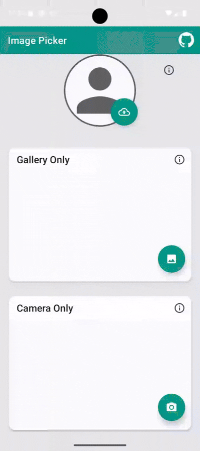

# 📸 Image Picker Library for Android


[](https://github.com/Catlandor/ImagePicker/actions/workflows/android.yml)
[](https://github.com/catlandor/ImagePicker/releases)
[](https://android-arsenal.com/api?level=21)


[](https://opensource.org/licenses/Apache-2.0)

A user-friendly and configurable library to **pick an image from the gallery or capture an image using the camera**. It also allows you to **crop the image** based on aspect ratio, resolution, and image size.

## 👾 Features

- Choose and pick from your gallery images
- Pick images from Google Drive
- Capture camera images
- Crop images (crop image based on provided aspect ratio or let the user choose)
- Resize images
- Retrieve image result as file, file path as String, or Uri object
- Handle runtime permission for camera and storage

## 🎬 Preview


|              Profile Image Picker              |          Gallery Only          |         Camera Only          |
|:----------------------------------------------:|:------------------------------:|:----------------------------:|
|  |  |  |

## 💻 Installation


### Gradle

Add the following to your project's `build.gradle`:

```groovy
allprojects {
   repositories {
        mavenCentral() // For ImagePicker library
        maven { url "https://jitpack.io" }  // For uCrop - an internal library
   }
}
```

Add the dependency to your app's build.gradle:

```groovy
implementation 'io.github.catlandor:ImagePicker:$libVersion'
```

Where `$libVersion`
= 

## 💻 Usage

### Kotlin

1. Register for activity result:

```kotlin
private val launcher =
    registerForActivityResult(ActivityResultContracts.StartActivityForResult()) {
        when (it.resultCode) {
            Activity.RESULT_OK -> {
                val uri: Uri = it.data?.data!!
                // Use the uri to load the image
            }
            ImagePicker.RESULT_ERROR -> {
                val errorMessage = ImagePicker.getError(it.data)
                // Process the error message, e.g. show a toast
            }
            else -> {
                // In case the user cancels the process of selecting an image.
            }
        }
    }
```

2. Launch ImagePicker:

```kotlin
ImagePicker
    .with(this)
    .provider(ImageProvider.BOTH)
    .createIntentFromDialog { launcher.launch(it) }
```

### Java

1. Register for activity result:

```java
ActivityResultLauncher<Intent> launcher =
    registerForActivityResult(new ActivityResultContracts.StartActivityForResult(), (ActivityResult result) -> {
        if (result.getResultCode() == RESULT_OK) {
            Uri uri = result.getData().getData();
            // Use the uri to load the image
        } else if (result.getResultCode() == ImagePicker.RESULT_ERROR) {
            // Use ImagePicker.Companion.getError(result.getData()) to show an error
        }
    });
```

2. Launch ImagePicker:

```java
ImagePicker.Companion
    .with(requireActivity())
    .provider(ImageProvider.BOTH)
    .createIntentFromDialog(it -> launcher.launch(it));
```

## 🎨 Customization

**Both Camera and Gallery:**

```kotlin
ImagePicker
    .with(this)
    //...
    .provider(ImageProvider.BOTH) //Or bothCameraGallery()
    .createIntentFromDialog { launcher.launch(it) }
```

- **Crop image:** `.crop()`
- **Crop image with 16:9 aspect ratio:** `.crop(16f, 9f)`
- **Crop square image:** `.cropSquare()`
- **Oval crop image:** `.crop().cropOval()`
- **Resize image: Set max width and height of final image:** `.maxResultSize(512, 512, keepRatio = true)`
- **Let the user resize crop bounds:** `.crop().cropFreeStyle()`
- **Allow multiple file selection:** `.setMultipleAllowed(true)`
- **Set output format:** `.setOutputFormat(Bitmap.CompressFormat.WEBP)`
- **Limit MIME types:** `.galleryMimeTypes(mimeTypes = arrayOf("image/png", "image/jpg", "image/jpeg"))`
- **Camera option only (without gallery):** `.cameraOnly()`
- **Gallery option only (without camera):** `.galleryOnly()`


**Java sample for using `createIntentFromDialog`:**

```java
ImagePicker.Companion
    .with(this)
    .crop()
    .cropOval()
    .maxResultSize(512,512,true)
    .provider(ImageProvider.BOTH) //Or bothCameraGallery()
    .createIntentFromDialog((Function1)(new Function1(){
        public Object invoke(Object var1){
            this.invoke((Intent)var1);
            return Unit.INSTANCE;
        }

        public final void invoke(@NotNull Intent it){
            Intrinsics.checkNotNullParameter(it,"it");
            launcher.launch(it);
        }
    }));
```

**Let the user to resize crop bounds:**

```kotlin
.crop()                                                  
.cropFreeStyle()
```

**Intercept ImageProvider; could be used for analytics purposes:**

```kotlin
ImagePicker
    .with(this)
    .setImageProviderInterceptor { imageProvider -> //Intercept ImageProvider
        Log.d("ImagePicker", "Selected ImageProvider: "+imageProvider.name)
    }
    .createIntent()
```

**Intercept dialog dismiss event:**

```kotlin
ImagePicker
    .with(this)
    .setDismissListener {
        // Handle dismiss event
        Log.d("ImagePicker", "onDismiss");
    }
    .createIntent()
```

**Limit MIME types while choosing a gallery image:**

```kotlin
.galleryMimeTypes(
    //Exclude gif images
    mimeTypes = arrayOf(
        "image/png",
        "image/jpg",
        "image/jpeg"
    )
)
```

**Add following parameters to your **colors.xml** file, if you want to customize the uCrop activity:**

```xml
<resources>
    <!-- Here you can use your own colors to customize the crop view  -->
    <!-- Background color of the top status bar -->
    <color name="ucrop_color_toolbar">@color/ucrop_color_white</color>

    <!-- Background color of the bottom widget bar -->
    <color name="ucrop_color_widget_background">@color/ucrop_color_ebony_clay</color>

    <!-- Background color behind the image to be cropped -->
    <color name="ucrop_color_crop_background">@color/ucrop_color_black</color>

    <!-- Color of the status bar title, including button icons -->
    <color name="ucrop_color_toolbar_widget">@color/ucrop_color_black</color>

    <!-- Color of the inactive (not selected) widgets -->
    <color name="ucrop_color_inactive_controls_color">@color/ucrop_color_heather</color>

    <!-- Color of the active (selected) widget: Including the text -->
    <color name="ucrop_color_widget_active">@color/ucrop_color_white</color>

    <!-- Color of the lines for the progress wheel (e.g. for zooming in) -->
    <color name="ucrop_color_progress_wheel_line">@color/ucrop_color_ebony_clay</color>
</resources>
```

## 💥 Compatibility

  * Library - Android Lollipop (API 21)
  * Sample - Android Lollipop (API 21)

## 📃 Used Libraries
* uCrop-n-Edit [https://github.com/jens-muenker/uCrop-n-Edit](https://github.com/jens-muenker/uCrop-n-Edit)
* ImagePicker original repository [https://github.com/Dhaval2404/ImagePicker](https://github.com/Dhaval2404/ImagePicker)
* ImagePicker fork, on which this fork is based on [https://github.com/Drjacky/ImagePicker](https://github.com/Drjacky/ImagePicker)

## License

[](https://opensource.org/licenses/Apache-2.0)
